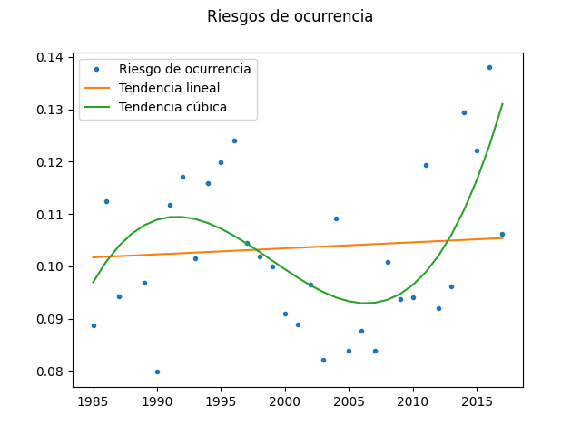

# Cálculo del riesgo en terremotos
## Proyecto final de la materia Peligros y Riesgos
## Josué Francisco Soto Cortez 
##### josusotz@gmail.com
### ENES, Unidad Morelia, UNAM

Licencia del repositorio: GNU GENERAL PUBLIC LICENSE (Version 3, 29 June 2007)

## Información para la instalación
Este programa esta diseñado para Python 3, el cual debe de estar instalado en la computadora con la que se vaya a ejecutar el prgorama. <br>
Para la ejecución del programa, se necesitan las librerias **Numpy, Random y Matplotlib** y para instalarlas con PIP se usa el siguiente comando en nuestra terminal: <br>
```
pip install numpy matplotlib random
``` 
Con esto será suficiente para ejecutar el programa. Ahora se clona el repositorio, y dentro del repositorio se ejecuta el siguiente comando para ejecutar el programa.
```
python riesgo.py
```
Nota: en caso de que la versión de Python al ejecutar `python riesgo.py` es la versión 2, se escribe como `python3 riesgo.py` al igual para lainstalación de librerias con `pip3`. <br>

## Introducción
Terremoto, un fenómeno que actúa como un movimiento brusco en la Tierra, causado por la liberación de energía acumulada durante un tiempo prolongado en las placas tectónicas. <br>
Estos eventos han sido presentes desde que existe la Tierra, aunque el estudio de los mismos es relativamente reciente por la sismología, esta rama de la geofísica, estudia los terremotos y cómo se comportan dentro de la superficie de la tierra. Hasta el día de hoy, la Sismología ha sido de gran ayuda para medir los terremotos. <br>
Con lo desarrollado que es el internet ahora, y con el alcance a datos que ofrece la comunidad, El Centro Nacional de Información de Terremotos (NEIC con sus siglas en Inglés) puso a su disposición un data set de terremotos que han ocurrido en todo el mundo durante 1965 hasta el 2016 con una magnitud mayor o igual a 5.5 para el uso de investigación científica. <br>

### Datos: Significant Earthquakes, 1965-2016
Acceso a los datos [en este link.](https://www.kaggle.com/usgs/earthquake-database)<br> 
Data set que contiene día, hora, lugar, profundidad, magnitud y fuente de todos los terremotos con magnitud mayor o igual a 5.5 desde 1965 hasta 2016. <br>

#### Atributos 
Fecha (Date): la fecha de cada evento viene definida como mm/dd/aaaa <br>
Hora (Time): la hora viene definida como hh:mm:ss. <br>
Lugar (Latitude y Longitude): el lugar viene definido en dos columnas, con latitud y longitud.<br>
Tipo (Type): Los terremotos mayormente son originados por las placas tectónicas, pero también pueden ser originados por explosiones nucleares o algún otro evento de una gran magnitud. <br>
Profundidad (Depht): es donde la energía se libera en un terremoto. <br>
Magnitud (Magnitude): Medición del terremoto. <br>
Tipo de Magnitud (Magnitude Type): Las diferentes escalas para medir un terremoto, como Escala de Richter (ML), entre otras. <br>

## Objetivo
En esta práctica, se va a hacer uso de esos datos para calcular el riesgo de ocurrencia de temblores mayores a 6.5 en un periodo de 10 años (2017-2027) en todo el mundo. <br>
También se va a calcular el riesgo que tuvieron desde los años 1985 hasta el año 2017 para poder evaluar cual es la tendencia del riesgo y poder observar cómo se podría comportar el riesgo en años actuales.

## Desarrollo

Se comenzó con el análisis de los datos, dado que son datos públicos y que no conocemos, lo primero era ver que los datos estuvieran completos y localizar datos que no fueran uniformes para ver si podíamos modificarlos, o excluirlos.

### Observaciones para la manipulación de datos.
Para el cálculo del riesgo solo tomaremos el dato de la magnitud, con el tipo de magnitud MW (escala sismologica de magnitud del momento), ya que es el tipo con mayores registros. Es una escala que no se satura al evaluar sismos de gran intensidad (mega terremotos) y es la que se ha desarrollado más recientemente, que se considera una aproximación cuantitativamente con una base física más fuerte que la Escala Richter. <br>
Durante la observación de los datos, se pudo observar que los registros de magnitud MW son muy variados desde 1965 hasta 1983, y a partir de 1984 empiezan a ser datos con más uniformidad, así que excluí los registros del año 1965 hasta 1983, para que en la evaluación de la tendencia no existan valores atípicos y que la tendencia sea más precisa. <br>

#### Modificación de datos

* Para la exclusión de datos del 1965 hasta el 1983 eliminamos desde la línea 2 hasta la línea 6865 de nuestro archivo de datos `earthquakes.dat` y así quedarnos con un total de 16545 registros.
* Modificación de formato de fecha en los registros 648 y 13784 (contando que ya excluí los datos de 1965 a 1983)
* Para que el código que se creó funcionara, agregué un registro al final de los datos que es el siguiente: `01/01/2017   5.0   MW` 

### Metodología

En este trabajo se hace uso de la formula vista en clase sobre el cálculo del riesgo, que es *R = 1-(1-P)^n* donde *n* son los multiplos de años en *m* tiempo, y *P* la probabilidad de que un evento ocurra en *m* tiempo. <br>

### Implementación

Para el primer objetivo se usan los registros del año 2016 para poder hacer este cálculo, sabiendo que de un total de 433 sismos registrados, 46 sismos son mayor o igual de 6.5. <br>
Para el segundo objetivo se hace uso de un ciclo para ir evaluando el riesgo de ocurrencia del año siguiente al que se está corriendo en la iteración del ciclo. Por ejemplo, evaluó los sismos del año 1984 para poder calcular el riesgo del año 1985, y así sucesivamente con todos los años que hay registro en este dataset. Al tener el riesgo de ocurrencia de todos estos años (1985-2017) se graficaron con la ayuda de `matplotlib`, y con la ayuda de la librería de `numpy` y su función `polyfit` se pudo visualizar la tendencia de los datos con un polinomio de grado 1 y despues de ver como se comportaba con otros grados, se hizo tambien con un polinomio de grado 3.

### Resultados
Para el primer objetivo, que realmente es sencillo, se aplicó la fórmula mencionada sobre el calculo del riesgo y se pudo obtener que el riesgo de ocurrencia de un sismo mayor o igual a 6.5 en un periodo de 10 años (2017-2027) es `0.674739978287348`. <br>
Para el segundo objetivo se obtuvo la siguente grafica: <br>
<br>

<br>
Donde podemos ver como se va comportando el riesgo a través de los años, y se puede observar la tendencia lineal y cubica de estos datos. <br>

### Conclusiones 
Con los resultados que se obtuvieron, puedo notar que esta información puede ser valiosa para toda la sociedad. Puede ayudar a una correcta toma de decisciones en cuanto a planes de emergencia en los proximos años ante un evento tan fuerte como lo son los sismos mayores de 6.5 MW. <br>
Con la tabla podemos ver que tanto en la tendencia lineal, y en la tendencia cubica, va aumentando cada vez mas este riesgo. Analizando la tendencia lineal, se puede notar que poco a poco va incrementando, mientras que la tendencia cúbica muestra como ha sido el comportamiento mas preciso del riesgo, y se ha notado un incremento considerable en los ultimos 10 años. Esto pone a pensar en que en cualquiera de las 2 tendencias, el riesgo de ocurrencia cada vez es mayor y cada vez tenemos que estar mejor preparados para estos eventos, y que la resilencia ante un sismo, sea lo menor posible.


